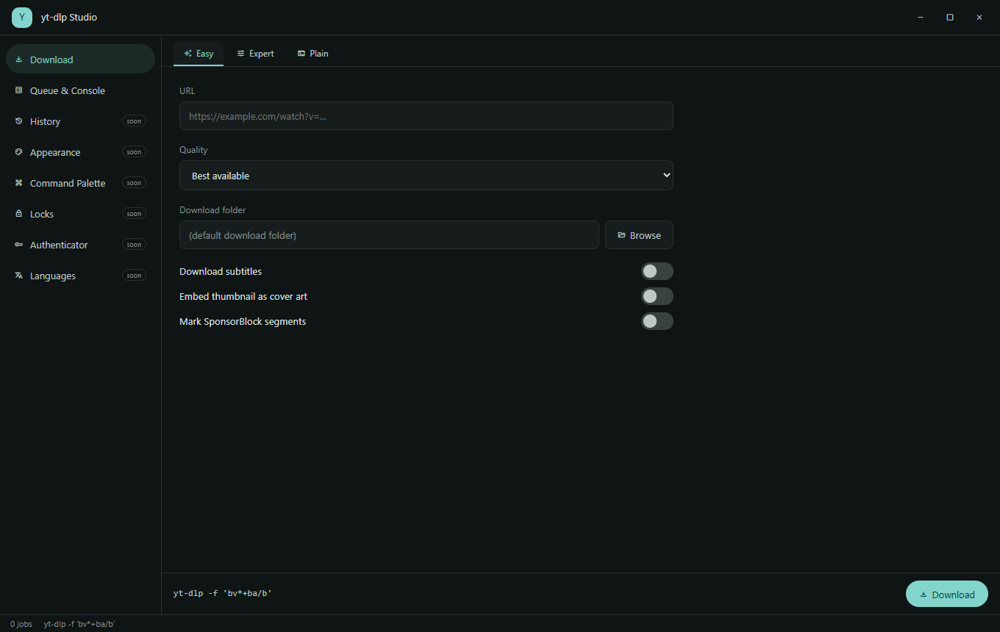
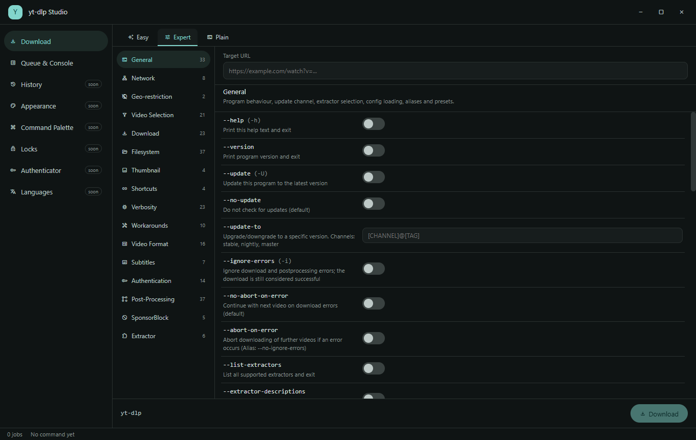
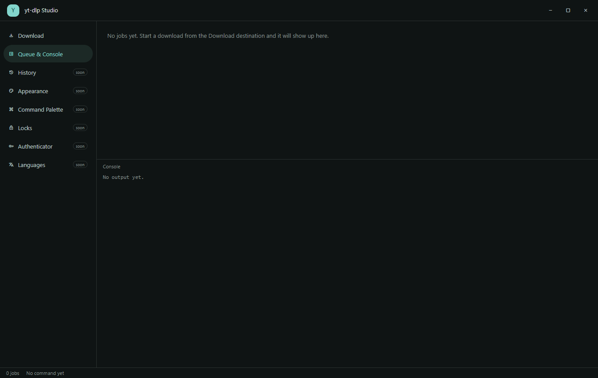

# yt-dlp Studio


-orange)

A Material Design 3 desktop application for [yt-dlp](https://github.com/yt-dlp/yt-dlp) on
Windows. yt-dlp Studio gives yt-dlp's enormous flag surface a guided, searchable interface —
Easy mode for a one-click download, Expert mode for every option grouped and explained, and
Plain mode for typing raw arguments — plus a queue, a live console with error-repair wizards,
and a companion browser extension.

**Nothing to install but the app.** yt-dlp is compiled from pinned upstream source at build
time, and ffmpeg is compiled from the FFmpeg source tree. Both ship inside the installer. No
Python, no PATH setup, no hunting for an ffmpeg build.

- Documentation: see [`docs/`](docs/README.md) for the full feature index.
- Design reference: see [`design/`](design/) and [`design/HANDOFF.md`](design/HANDOFF.md).

## Every feature

Screenshots for each are in the [gallery](#screenshot-gallery) below. Anything not yet built is
listed in [Not built yet](#not-built-yet) rather than quietly omitted.

### Downloading

| Feature | What it does |
| --- | --- |
| **Easy mode** | Paste a URL, pick a folder, press Download. Quality, subtitles and thumbnail switches, nothing else in the way. |
| **Expert mode** | All **16 option groups and 250 flags** from yt-dlp's own documentation, each rendered as the right control — switch, text, slider, select, date, path or chips — with its real help text. |
| **Plain mode** | A raw argument box for when you already know exactly what you want. |
| **Live command preview** | The exact arguments that will be spawned, updating as you change anything. |
| **Argument-array execution** | The command is passed as an array, never through a shell, so a URL can never be interpreted as one. |
| **Real progress** | Parsed from `--progress-template` and aggregated across fragments, not scraped off the human-readable bar. |
| **Queue** | Multiple jobs with per-job state, cancel, retry and remove. |
| **Live console** | Real stdout and stderr, with errors and warnings marked. |
| **Honest pause** | Windows has no `SIGSTOP`, so the control reads *Stop (resume continues the file)* and resumes with `--continue` rather than pretending to suspend a process. |

### What is inside the installer

| Feature | What it does |
| --- | --- |
| **yt-dlp built from source** | Compiled from the pinned `vendor/yt-dlp` submodule with PyInstaller during the build. Not downloaded, not a binary of unknown provenance. |
| **ffmpeg built from source** | Compiled from the pinned `vendor/ffmpeg` submodule. An **LGPL** build: `--enable-gpl` is never passed and `--enable-nonfree` never will be. |
| **Dependencies track upstream** | Both submodules follow `master` and are advanced on every pull, because yt-dlp breaks when a site changes and is fixed upstream within days. |
| **Build provenance in every release** | Release notes carry the yt-dlp version, the exact submodule commit it was built from, and the SHA-256 of both the binary and the installer. |
| **One-click builds** | `build.bat` and `build-installer.bat` install every dependency themselves, from a bare Windows machine, with a silent `/s` mode. |

### Interface

| Feature | What it does |
| --- | --- |
| **Material Design 3** | Tokens, typography, shape and elevation throughout, on a dark teal palette. |
| **Frameless window** | A custom Material title bar rather than the operating system's default chrome. |
| **Navigation rail** | Destinations down the left, with unbuilt ones plainly labelled as unbuilt. |
| **Catalog drift guard** | A test fails the build if the shipped option catalog and the design reference ever disagree — verified by breaking it on purpose and watching it go red. |

### The site

| Feature | What it does |
| --- | --- |
| **Landing and documentation site** | Fully self-contained: no CDN, no remote fonts, no analytics, nothing fetched at page load. |
| **Command planner** | Composes a real yt-dlp command from form inputs, with copy-to-clipboard and a graceful fallback. |
| **Page search with a regex builder** | Plain text by default, regex as an explicit opt-in, with an anchored builder popover. |
| **Light and dark themes** | Follows the system by default, with a toggle that persists. |
| **Genuinely mobile** | Verified at 375px: no off-screen controls, a 57px header, no sideways scroll. |

## Committed but not built yet

Everything below is a real commitment with a roadmap row, **not a claim about the current
build**. None of it ships today. It is listed in full because an absence that reads as a
decision is better than one that reads as an oversight — and because this is the standard every
surface in the project is eventually held to. See [`ROADMAP.md`](ROADMAP.md).

### Language and voice

| Planned | What it will do |
| --- | --- |
| **Three language modes** | English, playful Hong Kong Cantonese, and a bilingual mode showing both without crowding the layout. |
| **Two playfulness sliders** | One per language, 1 (fully serious) to 5 (maximum playfulness), wired to the copy the app actually renders. Voice changes; the facts never do — a warning still names exactly what will happen at every level. |
| **Emoji toggle** | Decorative emoji in dialogs and message boxes, on or off, never inside button or control labels. |
| **Spoken narrator** | Text-to-speech for app events, **off by default**, with per-language voice, rate and pitch selection, a serialised queue so lines never overlap, and deference to an active screen reader. |

### Accessibility and focus

| Planned | What it will do |
| --- | --- |
| **ADHD modes** | Five independent toggles — Focus, Low stimulation, Time awareness, One thing at a time, Momentum — all off by default. Interface accommodations, never medical claims, and never scolding copy, streaks or scores. |
| **School mode** | One shared switch that hides the playful capabilities across every app at once, renameable by the user, and unlocked with a locally verified credential. A user-experience lock, not a security boundary, and it says so. |
| **Unlock ladder** | Locked out? Play your way out: identify a dim sum dish, then ten quick sums, then whack-a-mole. It clears the *waiting*, never the credential — you still need your password — and it is budgeted so it can never become a cheaper brute force. |

### Customisation

| Planned | What it will do |
| --- | --- |
| **Per-element appearance editor** | Right-click any rendered element and restyle it: word-processor-depth typography, every installed font, spacing, shape, elevation and state. |
| **Infinite colour picker** | A continuous spectrum with numeric entry, plus a translator converting between HEX, RGB, HSL, HSV, HWB, CIELAB, OKLCH and CMYK, with contrast readouts — and an animated rainbow option. |
| **Rename the app** | Change the name the app calls itself. Display only: the data directory, installer identity and update feed never move. |
| **App-mark customisation** | Swap the application mark for shipped presets or your own image, converted locally with no upload. |
| **Themes, density, scale** | Light and dark, density, accent colour, font family and size, corner radius, reduced motion — all persisted, exportable and importable. |
| **Scheduled settings** | Put any of the above on a schedule, or drive it from a local API or a Home Assistant switch. |

### Getting around

| Planned | What it will do |
| --- | --- |
| **Command palette** | `Ctrl+Shift+F` opens every command, page and setting, with live controls inline in the results and teleport-with-highlight to the exact element. |
| **Browser-style tabs** | Dockable to any edge (left by default), with overflow, reordering, pinning, groups, and four separate tab searches. |
| **Regex builder on every search** | Every search field, dropdown and right-click menu gets a filter with an anchored regex builder beside it. Plain text stays the default. |
| **Guided forms** | Pickers populated from real data instead of empty boxes, and every disabled control names the exact condition it is waiting on. |

### Your data

| Planned | What it will do |
| --- | --- |
| **Local version history** | A local Git-backed history of the download list and every setting, with a day-grouped manager, a diff inspector, restore points and rich filters. Restoring is itself a new entry, so an undo can be undone. |
| **Export everything** | Every list and record exportable as JSON, JSONL, YAML, TOML, XML, CSV, TSV, Markdown, HTML and SQL, plus ZIP and 7z archives with the full 7z option surface. |
| **Bulk actions everywhere** | Multi-select, range select, honest select-all, inverse selection, and every single-item action available in bulk with a reviewable preview first. |
| **Built-in authenticator** | Standards-compliant TOTP with QR pairing, generated locally with no network call, secrets held in the operating-system credential vault. |
| **Per-element toy locks** | Lock any element behind its own password or one-time code. Explicitly for fun, not security, and it tells you exactly how to recover. |
| **File converter** | A local converter with a categorised adapter catalog, honest disclosure of what each conversion loses, and an unlimited queue that never loads every file into memory. |
| **Local model suite** | Manage locally installed Ollama models, with conservative hardware-fit verdicts backed by evidence rather than guesses. |

### Everywhere else

| Planned | What it will do |
| --- | --- |
| **Non-blocking notifications** | Corner toasts with a reviewable history. Modals reserved for decisions you must actually make. |
| **Two-key destructive gate** | Anything irreversible needs two independent keys and a full-range slider before it will run. |
| **Changelog viewer** | Every released version in-app, with a date picker, search and a link to the commit behind each entry. |
| **Automatic updates** | Chrome-style background updates with a non-blocking ready banner, honest about the artifacts being unsigned. |
| **Companion browser extension** | Popup, injected page controls, and an options page, with real download start, progress and completion surfaces. |
| **Automated tests** | This build ships with **none**, by decision, and the records say so everywhere rather than implying coverage that does not exist. |

## Screenshot gallery

<!-- HUISHOT-GALLERY -->
Every image below is a capture of the **real built application**, taken from the packaged build
through an off-screen desktop. None of them is a mockup, a design export, or a hand-edited image.

<details open>
<summary><b>Easy mode</b> — paste a URL, pick a folder, go</summary>



</details>

<details>
<summary><b>Expert mode</b> — all 16 groups and 250 flags</summary>



</details>

<details>
<summary><b>Queue and console</b></summary>



</details>
<!-- /HUISHOT-GALLERY -->

## Quick start

```bat
:: builds a runnable app in the checkout
build.bat

:: builds the distributable Windows installer
build-installer.bat
```

Both scripts install every dependency they need themselves and support a silent `/s` mode for
unattended use. See [`docs/features/build-and-packaging/`](docs/features/build-and-packaging/README.md).

<details>
<summary><b>What it does</b></summary>

- **Easy mode** — paste a URL, pick quality and destination, download.
- **Expert mode** — every yt-dlp CLI option (~250 flags across 16 groups), searchable, with
  plain-language help for each one and a live command preview.
- **Plain mode** — a raw argument editor for people who already know the flags they want.
- **Queue** — batch downloads with per-item progress parsed from yt-dlp's
  `--progress-template` output, pause/resume, retry, and reordering.
- **Console** — live stdout/stderr with color-coded lines; errors surface a guided repair
  wizard matched against known yt-dlp failure patterns.
- **Companion extension** — a Chrome extension that hands the current page's video URL to the
  desktop app, with its own popup, injected page controls, and options page.

</details>

<details>
<summary><b>The bundled-binaries story</b></summary>

`vendor/yt-dlp` is the official yt-dlp source, pinned as a git submodule at a fixed commit and
version. The build compiles a Windows executable from that source with PyInstaller and bundles
it into the installer alongside pinned `ffmpeg.exe`/`ffprobe.exe` builds. Nothing is downloaded
at runtime and nothing needs to be pre-installed by the user. See
[`docs/features/build-and-packaging/bundled-binaries.md`](docs/features/build-and-packaging/bundled-binaries.md)
and
[`docs/features/build-and-packaging/building-yt-dlp-from-source.md`](docs/features/build-and-packaging/building-yt-dlp-from-source.md).

</details>

<details>
<summary><b>Architecture</b></summary>

- **App shell:** Electron + Vite + React 19 + TypeScript.
- **Process layer:** the Electron main process spawns the bundled `yt-dlp.exe` with an argv
  array built from the selected flags, and parses its `--progress-template` output into
  structured job state rather than scraping the human-readable progress bar.
- **Packaging:** Squirrel.Windows (`Setup.exe`, `RELEASES`, full `.nupkg`, delta packages).
  Code signing is permanently out of scope for this project; installers are unsigned and will
  trigger the Windows unknown-publisher warning. See
  [`docs/features/build-and-packaging/squirrel-packaging.md`](docs/features/build-and-packaging/squirrel-packaging.md).
- **Design reference:** the `design/` folder holds the checked-in Claude Design export that the
  interface is being wired against — see
  [`docs/features/design-reference/design-reference-parity.md`](docs/features/design-reference/design-reference-parity.md).

</details>

<details>
<summary><b>Project status (read this before assuming anything is finished)</b></summary>

This repository is under active development. The design reference, the yt-dlp submodule pin,
and the Electron/Vite/React scaffold are in place. The build scripts, the main-process
integration with yt-dlp, and the renderer wiring for the flag catalog, queue, and console are
in progress. A large list of features described in the design reference — language modes,
narrator, School mode, the command palette, browser-style tabs, the appearance editor, the
local-AI suite manager, and more — are **not yet implemented**. See
[`ROADMAP.md`](ROADMAP.md) for the authoritative checklist and
[`docs/completeness-inventory.md`](docs/completeness-inventory.md) for the per-feature status
table.

**This pass shipped without an automated test suite and without screenshot/capture evidence,**
on the maintainer's explicit instruction, in order to ship quickly. See
[`HANDOFF.md`](HANDOFF.md) for the exact, honest verification status of everything in this
repository. Nothing in this README, in `docs/`, or in release notes should be read as claiming
a test passed or a screenshot was taken unless it says so explicitly.

</details>

<details>
<summary><b>Screenshots</b></summary>

Screenshots of the built application are pending. Real captures from the running application
will be added here once a build exists to capture. Until then, see the design reference files
in [`design/`](design/) for the intended interface — those are design exports, not captures of
the running app, and are labeled as such.

</details>

<details>
<summary><b>Size of the project, and how long a person would have taken</b></summary>

Counted by the committed counter, `node scripts/count-lines.mjs`, which is the same script the
release workflow runs. Vendored code, dependencies, build output and lockfiles are excluded, so
these are lines belonging to this project.

| Area | Total lines |
| --- | ---: |
| Design references (the transcribed option catalog and design components) | 7,720 |
| Site, build scripts and root files | 2,950 |
| Application main process | 978 |
| Application renderer | 443 |
| Scripts | 418 |
| Documentation | 347 |
| Application (other) | 310 |
| Workflows | 185 |
| Application preload | 138 |
| **Total** | **13,489** |

### How long would a human have taken?

**Roughly three to six months of full-time work for one experienced developer.**

That is an **estimate**, not a measurement. Nobody built this by hand, so there is no real figure to
report — what follows is the arithmetic it came from, so you can disagree with the assumptions
rather than with the conclusion:

- **Implementation code — about 5,769 lines** (the total above, less the design references). At a
  sustained **50 to 100 lines per day** for production code including design, debugging,
  documentation and rework — not the burst rate anyone hits on a good afternoon — that is
  **58 to 115 working days**.
- **Design reference catalog — 7,720 lines.** This is largely transcription: roughly 250 yt-dlp
  options with their help text, read out of upstream documentation. Transcription runs far faster
  than authored logic, so at **400 to 800 lines per day** it is **10 to 19 working days**.
- **Together: 68 to 134 working days**, which at five days a week is about **14 to 27 weeks**.

The range is wide on purpose. A single figure would imply a precision this kind of estimate does not
have, and the honest answer to "how long is this" is a range with its workings shown.

</details>

<details>
<summary><b>Contributing, security, license</b></summary>

See [`CONTRIBUTING.md`](CONTRIBUTING.md), [`SECURITY.md`](SECURITY.md),
[`CODE_OF_CONDUCT.md`](CODE_OF_CONDUCT.md), and [`AGENTS.md`](AGENTS.md) (engineering rules for
contributors and agents working in this repository). Licensed under
[The Unlicense](LICENSE), matching yt-dlp's own license choice.

</details>
